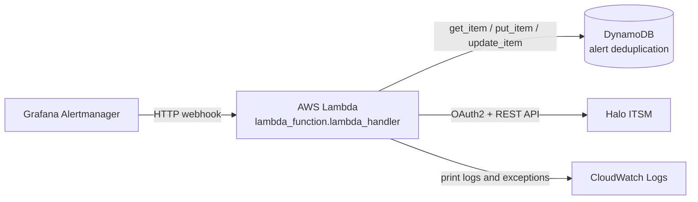

# M2C IoT Alert Processor

AWS Lambda integration that receives Grafana Alertmanager webhooks, creates Halo ITSM tickets for M2C IoT alerts, and adds resolution notes when alerts clear.

## Architecture



The intended processing path is:

```text
Grafana Alertmanager
  -> HTTP integration/API Gateway or equivalent
  -> AWS Lambda
  -> DynamoDB lookup
  -> Halo ticket or resolution action
  -> DynamoDB state update
  -> HTTP response
```

The repository confirms the Lambda handler and application behavior. The actual HTTP trigger, API Gateway configuration, IAM policies, VPC settings, retry policy, and dead-letter configuration must be verified in AWS because they are not included here.

## Repository Contents

| Path | Purpose |
| --- | --- |
| `src/lambda_function.py` | Handler entry point; orchestrates the modules below. |
| `src/config.py` | Environment-driven configuration (`load_config`). |
| `src/halo_client.py` | Halo OAuth2 client and ticket/note requests. |
| `src/dedup_repository.py` | DynamoDB-backed alert deduplication. |
| `src/routing.py` | `M2C` alert-type -> Halo team/action routing table. |
| `src/ticket_builder.py` | Builds Halo ticket and resolution-note payloads. |
| `src/metrics.py` | CloudWatch embedded metric format (EMF) helpers. |
| `tests/` | Unit and integration tests using in-memory fakes (see `tests/README.md`). |
| `tools/reconciliation/` | Read-only CLI that classifies DynamoDB dedup records against Halo; never mutates either system. |
| `iac/` | Terragrunt/Terraform for the Lambda, DynamoDB table, IAM, API Gateway, and alarms (`non-prod/uat` deployed so far). |
| `.github/skills/halo-mock-harness/` | Local mock of Halo (success/failure scenarios, replay fixtures) for testing without live Halo access. |
| `config-audit.json` | Local snapshot of deployed Lambda metadata and environment configuration. It is ignored by Git because it contains sensitive values. |

## Entry Point

The deployed handler is:

```text
lambda_function.lambda_handler
```

The implementation is stored in [`src/lambda_function.py`](src/lambda_function.py).

The function accepts the standard Lambda `event` and `context` arguments. The current implementation uses `event` and does not use `context`.

## Execution Flow

### Request authentication and parsing

The handler expects an HTTP proxy-style event containing headers and a JSON string body:

```json
{
  "headers": {
    "Authorization": "Bearer <webhook-secret>"
  },
  "body": "{\"status\":\"firing\",\"alerts\":[...]}"
}
```

It:

1. Normalizes request header names to lowercase.
2. Reads the `Authorization` header and compares its Bearer token with `WEBHOOK_SECRET`.
3. Returns `401 Unauthorized` for an invalid or missing token.
4. Parses `event.body` as JSON.
5. Returns `400 Invalid JSON` if the body cannot be parsed.
6. Processes each item in `body.alerts` sequentially.

The implementation does not currently decode `event.body` when an API Gateway integration sets `isBase64Encoded` to `true`.

### Firing alerts

For each alert with `status: "firing"`:

1. Read the alert fingerprint.
2. Skip the alert if no fingerprint is present.
3. Look up the fingerprint in DynamoDB.
4. Skip the alert as a duplicate if a record already exists.
5. Convert the Grafana alert into a Halo ticket payload.
6. Obtain or reuse a cached Halo OAuth token.
7. Create the ticket through Halo.
8. Store the fingerprint, ticket ID, metadata, status, URL, and TTL in DynamoDB.

### Resolved alerts

For each alert with `status: "resolved"`:

1. Read the fingerprint and find its DynamoDB record.
2. Continue only when the record exists and has `status: "open"`.
3. Build a resolution note.
4. Add the note to the existing Halo ticket.
5. Mark the DynamoDB record as `resolved` and save `resolved_at`.

A resolved alert without an open record is skipped. It cannot create a new ticket.

### Other statuses

Statuses other than `firing` and `resolved` are skipped and logged as unknown statuses.

### Response actions

The handler returns an HTTP-style response with a JSON body containing per-alert results. Possible actions include:

- `ticket_created`
- `skipped_duplicate`
- `ticket_updated`
- `skipped_no_open_ticket`
- `error`

A significant operational detail is that a per-alert processing error is caught and included in the result, while the overall handler can still return `statusCode: 200`. An upstream webhook sender may therefore treat a failed Halo operation as successfully delivered and may not retry it.

## Alert Routing

Routing is based on an exact, case-sensitive match of `alert.labels.M2C`.

| `labels.M2C` value | Halo team environment variable | Default team ID |
| --- | --- | ---: |
| `Low Battery` | `HALO_TEAM_EC1` | 12 |
| `Tamper` | `HALO_TEAM_EC1` | 12 |
| `No Usage` | `HALO_TEAM_EC1` | 12 |
| `Excessive Usage` | `HALO_TEAM_JW` | 13 |
| `No Communication` | `HALO_TEAM_EC1` | 12 |
| `Reverse Flow` | `HALO_TEAM_JW` | 13 |
| `Device Reboot` | `HALO_TEAM_INTERNAL` | 14 |
| Any other value | `HALO_TEAM_INTERNAL` | 14 |

Unknown alert types are not rejected. They are routed to the internal-team fallback and use the generic investigation action. Changes in capitalization, spelling, or whitespace can therefore send a ticket to the fallback team rather than the expected operational team.

## Halo ITSM Integration

The code uses Python's standard-library `urllib` modules rather than a dedicated Halo SDK.

| Purpose | Method | Endpoint |
| --- | --- | --- |
| OAuth2 client-credentials token | `POST` | `{HALO_BASE_URL}/auth/token` |
| Create ticket | `POST` | `{HALO_BASE_URL}/api/tickets` |
| Add resolution note | `POST` | `{HALO_BASE_URL}/api/Actions` |

The OAuth access token is cached at module scope and reused during warm Lambda invocations until it is within 60 seconds of expiry.

Ticket creation sends a payload containing:

```json
{
  "tickettype_id": 64,
  "team_id": 12,
  "summary": "[M2C] Low Battery - Device SN: DEVICE-123",
  "details": "formatted alert details"
}
```

The exact ticket type and team IDs are configurable through environment variables. The Lambda treats a Halo response containing a ticket ID as successful; it does not perform a follow-up read to verify the persisted team assignment.

## DynamoDB State

The configured DynamoDB table uses `fingerprint` as its key. Records contain the alert and ticket lifecycle state, including:

- `fingerprint`
- `ticket_id`
- `alert_type`
- `device_sn`
- `status` (`open` or `resolved`)
- `created_at`
- `resolved_at` when resolved
- `ttl`
- `halo_url`

The table is used for deduplication, not as a reconciliation system. A stale `open` record can suppress future firing alerts even when the referenced Halo ticket is closed, missing, incorrectly assigned, or not visible to the team.

## Configuration

The following environment variables are read by the Lambda:

| Variable | Required | Purpose |
| --- | --- | --- |
| `HALO_BASE_URL` | Yes | Halo host URL. Trailing slash is removed. |
| `HALO_CLIENT_ID` | Yes | Halo OAuth client ID. |
| `HALO_CLIENT_SECRET` | Yes | Halo OAuth client secret. |
| `HALO_TICKET_TYPE_ID` | No | Halo ticket type ID; default is `64`. |
| `HALO_TEAM_EC1` | No | EC1 team ID; default is `12`. |
| `HALO_TEAM_JW` | No | JW Metering team ID; default is `13`. |
| `HALO_TEAM_INTERNAL` | No | Internal Support team ID; default is `14`. |
| `DYNAMODB_TABLE` | Yes | DynamoDB deduplication table name. |
| `WEBHOOK_SECRET` | No | Expected inbound Bearer token; default is an empty string. |
| `DYNAMODB_TTL_DAYS` | No | Record retention period in days; default is `90`. |

Required variables use `os.environ[...]` and cause module initialization to fail if missing. The optional variables use defaults. Secrets should be supplied through approved secret management and must not be copied into source, documentation, or audit artifacts.

## Runtime and Dependencies

The deployed audit snapshot identifies:

- Runtime: Python 3.12
- Handler: `lambda_function.lambda_handler`
- Package type: ZIP
- Architecture: x86_64
- Memory: 128 MB
- Timeout: 30 seconds
- Log group: `/aws/lambda/csd-m2c-non-prod-alert-processor`

Python standard-library dependencies:

- `json`
- `os`
- `time`
- `urllib.request`
- `urllib.parse`
- `urllib.error`
- `datetime`

Third-party dependency:

- `boto3` for DynamoDB access.

`requirements.txt` / `requirements-dev.txt` pin `boto3` and `pytest` respectively; `pyproject.toml` configures `pytest` (`pythonpath = ["src", "tools/reconciliation"]`). The deployed package assumes `boto3` is available in the AWS Lambda runtime or was included during packaging.

## Local Development and Testing

```bash
pip install -r requirements.txt -r requirements-dev.txt
pytest
```

All tests run against in-memory fakes for Halo and DynamoDB - no AWS credentials, network access, or real Halo instance is required.

While live Halo access is unavailable, use the **halo-mock-harness** skill
(`.github/skills/halo-mock-harness/`) to test beyond the fakes: a loopback
HTTP server that reproduces real Halo success/failure responses (including
the `HTTP 400 "Ticket Type not found"` error seen in production logs), plus
a CLI to replay Alertmanager-shaped fixtures through the real `lambda_handler`.
See that skill's `SKILL.md` for the full unit -> integration -> e2e -> replay
test pyramid.

## Operations and Troubleshooting

The Lambda writes plain-text logs through `print()`.

| Log message | Meaning |
| --- | --- |
| `[INFO] ... alert(s)` | A webhook was parsed and the number of alerts was read. |
| `[OK] Created ticket ...` | Halo returned a ticket ID; verify the ticket's actual team in Halo. |
| `[SKIP] ... duplicate ...` | DynamoDB already contains the fingerprint; no new Halo ticket was requested. |
| `[OK] Resolution note added ...` | Halo accepted the resolution action and DynamoDB was updated. |
| `[SKIP] Resolved alert ... no open ticket` | No open DynamoDB record was found for the resolved alert. |
| `[HALO ERROR] ...` | Halo returned an HTTP error. |
| `[ERROR] Failed ...` | Per-alert processing failed; inspect the exception text. |
| `[AUTH] Rejected ...` | The webhook token did not match. |
| `[PARSE ERROR] ...` | The request body was not valid JSON. |
| `[SKIP] Unknown status ...` | The alert was neither `firing` nor `resolved`. |

For a missing team ticket, investigate in this order:

1. Confirm Grafana sent the webhook and the Lambda produced an `[INFO]` entry.
2. Find the alert's exact `M2C`, `status`, `fingerprint`, and device serial number.
3. Determine whether the result was `ticket_created`, `skipped_duplicate`, or `error`.
4. For a created ticket, inspect the actual Halo team, queue, visibility, and notification history.
5. For a duplicate, compare the DynamoDB record with the referenced Halo ticket.
6. For an error, inspect the Halo response, credentials, network path, and DynamoDB permissions.
7. If the ticket is correctly assigned but users were not notified, investigate Halo team membership and notification workflows. This Lambda does not send team notifications directly.

## Security Notes

- Do not commit Halo credentials or the webhook secret.
- `config-audit.json` contains sensitive-looking credential values in plaintext and should be treated as confidential. Rotate exposed credentials through the approved process and remove secrets from repository history or audit artifacts as appropriate.
- Use least-privilege IAM permissions for DynamoDB and CloudWatch Logs.
- The source does not prove the existence of a dead-letter queue, Lambda failure destination, VPC route, NAT Gateway, or API Gateway configuration. Verify these directly in AWS.
- Avoid logging full webhook payloads or secret-bearing request data in production.

## Scope and Limitations

This repository documents and implements the Lambda application only. It does not define the complete deployed system. A full operational verification requires access to Grafana, AWS Lambda, CloudWatch Logs, DynamoDB, IAM, networking, and Halo ITSM.

A successful Lambda log means Halo returned a ticket ID. It does not by itself prove that the ticket is assigned to the intended team or that team members received a notification. The persisted Halo ticket and its notification history are the operational source of truth.
